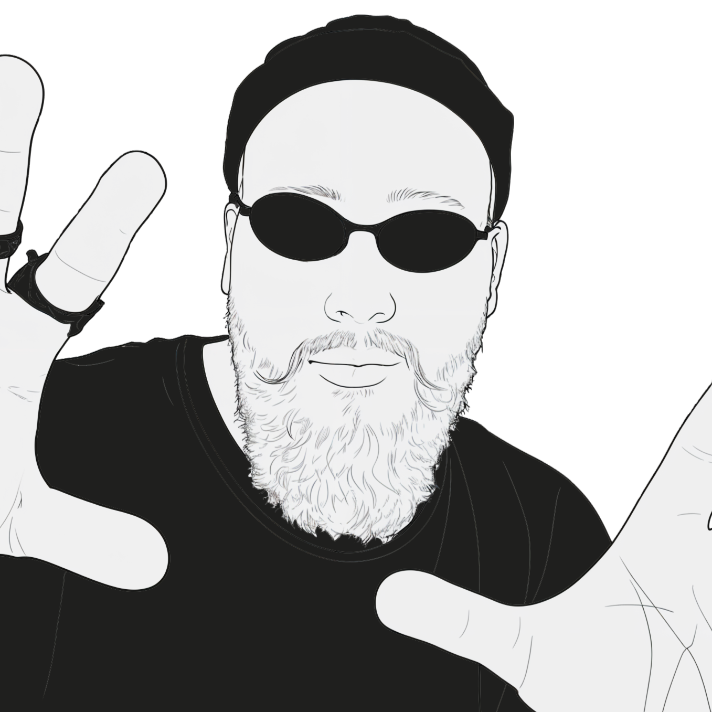

# 🤏 You Got Nikita'd

 

### You are now experiencing both my physical and digital presence.

 

[GitHub](https://github.com/litovn) · [LinkedIn](https://www.linkedin.com/in/litovchenko-nikita/) · [Email](mailto:nlitovchenko@proton.me)

